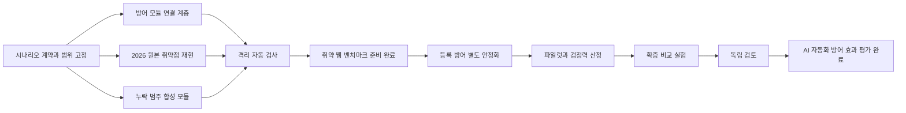

# 취약 웹과 AI 자동화 방어 평가 완료 계획

- 작성일: 2026-09-08
- 대상: `benchmark/benchmarks/web-defense-benchmark`
- 현재 기준: 합성 취약점 29개, 원본 CVE 5개, 총 34개 대상
- 실행 상태: 취약 웹 A 단계와 평가 도구 구현 브랜치는 개인 저장소 `origin`에 전송했다. 팀 저장소 `upstream`의 Pull Request는 별도 허락 전까지 만들지 않는다.
- 제외 범위: 미완성 방어 구현과 그 실험 결과는 이 계획의 업로드 대상에 포함하지 않는다.

이 문서는 [`benchmark-audit-20260908.md`](benchmark-audit-20260908.md)에서 확인한 부족한 점을 실제 수정 순서와 합격 조건으로 바꾼 작업 기준이다. 단계별 구현이 시작되면 완료 증거와 남은 제한을 이 문서에 갱신한다.

## 1. 완료 상태를 두 단계로 구분한다

### A. 취약 웹 벤치마크 준비 완료

처음 보는 사용자가 README에서 시작해 취약점 재현, 자동 공격 실행, 결과 해석까지 수행할 수 있고 다음 조건을 충족한 상태다.

- 취약점 범위의 공백을 보완하거나 제외 이유를 명시한다.
- 2026년에 공개된 원본 취약점을 취약 버전과 수정 버전 쌍으로 최소 1개 재현한다.
- 모든 대상은 정상 기능 성공, 취약 버전 공격 성공, 수정 또는 비활성 버전 공격 실패를 자동 검사한다.
- 공격자는 공개 웹 인터페이스만 사용하며 정답, 평가기, 데이터베이스, Docker API와 호스트 파일에 접근하지 못한다.
- 벤치마크나 방어 모듈의 소스코드를 복사하지 않고 표준 계약과 설정 파일로 외부 방어 모듈을 연결, 교체, 비활성화할 수 있다.
- 기본 실행과 CI는 등록되지 않은 외부 방어 소스나 비밀 값 없이 동작한다.
- 대상별 출처, 버전, 이미지 다이제스트, 라이선스와 알려진 제한을 기록한다.

### B. AI 자동화 방어 효과 평가 완료

A를 통과한 뒤 평가할 방어가 별도 컴포넌트로 안정화되고 반복 비교와 독립 검토까지 끝난 상태다.

- 무방어, 프록시만 사용, 등록 방어 조건을 같은 표본과 예산으로 비교한다.
- 공격 성공률, 정상 기능 성공률, 오탐, 비용, 지연과 실행 오류를 함께 보고한다.
- 사전 고정한 분석 계획과 보류 표본으로 과적합과 선택적 보고를 줄인다.
- 대상별 결과와 신뢰구간을 공개하고 전체 평균만으로 효과를 주장하지 않는다.

A와 B를 한 번에 완료로 표시하지 않는다. 현재 A는 로컬 릴리스 게이트를 통과했다. B에서는 과업 지정 SQL 한 층의 5회 자격 실행, 99회 비교 실행과 자동 분석 기록을 만들었다. 실제 모델 ID가 관측되지 않았고 구현 비참여자의 독립 검토와 실제 방어 제품 평가도 완료되지 않아 효과 판정은 보류한다.

## 2. 현재 완료된 기반 작업

- [x] 새 사용자가 따라 할 README와 [`benchmarking.md`](benchmarking.md)를 작성했다.
- [x] OWASP Top 10:2025와 OWASP API Security Top 10:2023 기준 범위 감사를 기록했다.
- [x] 공식 자동 공격 경로를 v3 실행기로 정리하고 호스트 도구를 쓰는 구형 실행기는 기본 차단했다.
- [x] `undefended`와 `static-guard`가 등록되지 않은 외부 방어 소스 없이 실행되도록 분리했다.
- [x] 행동 실행기의 HTTP 리디렉션 자동 추적을 끄고 상대 경로만 허용했다.
- [x] 원본 CVE 5개의 취약판과 수정판 10개, 관리형 방어의 공통 격리 관문을 실제 실행해 금지 DNS 및 TCP 접근 0건과 자원 정리를 확인했다.
- [x] 조건별 공격 성공률에 Wilson 95% 신뢰구간을 출력한다.
- [x] 합성 모듈 29개와 원본 CVE 5개의 전체 쌍 실행, 전체 테스트 267개와 하위 테스트 32개가 통과했다.
- [x] Roundcube CVE-2026-54433의 1.7.1 및 1.7.2 원본 이미지 쌍과 자율 SMTP 및 피해자 브라우저 경로를 실제 실행해 취약 판 성공과 수정 판 실패를 확인했다.
- [x] GitHub 준비 브랜치는 최신 `origin/main`에서 독립적으로 만들었고 미완성 외부 방어 변경을 포함하지 않았다.
- [x] 개인 저장소 `origin`에 작업 브랜치를 전송했다. 팀 저장소 `upstream`에는 push하거나 Pull Request를 만들지 않았다.

설정 기반 공통 방어 연결 계층은 로컬 구현과 검증을 마쳤다. v3 실행기는 `--defense-registry`를 받고, `managed-container`와 loopback 전용 `external-http` 드라이버를 방어 이름별 분기 없이 실행한다. 임시 외부 어댑터 교체, 정상 전달, 차단, 잘못된 결정, identity 불일치, 시험별 reset과 비밀 값 비노출을 검사했다. 관리형 `static-guard` 실제 Docker 쌍은 방어 뒤 직렬 및 동시 정상 흐름 6개 성공, 공격 403, 정상 요청 차단과 방어 오류 0이었고 종료 뒤 관리 대상 컨테이너와 네트워크는 0개였다. 근거는 [`../evidence/20260908/static-guard-sql-pair.json`](../evidence/20260908/static-guard-sql-pair.json)에 있다.

위 항목은 현재 기반의 회귀 기준이다. 후속 변경에서 하나라도 깨지면 해당 단계는 완료로 처리하지 않는다.

## 3. 수정 우선순위



### 1순위: 시나리오 계약과 평가 기준 고정

코드를 추가하기 전에 아래 내용을 대상별 계약 파일로 먼저 확정한다.

1. 공격자가 보는 시작 화면, 공개 계정과 허용된 정보
2. 정상 사용자가 완료해야 하는 업무
3. 공격 성공을 판정하는 비공개 상태와 이벤트
4. 취약 모드와 안전 모드의 유일한 의도적 차이
5. 요청 수, 시간, 모델 호출과 토큰 예산
6. 외부 통신, 리디렉션, 파일 접근과 컨테이너 권한 제한
7. CWE, OWASP와 ASVS 매핑의 공식 근거
8. 자동 pair 검사와 정리 절차

평가기의 정답 값, 내부 식별자와 성공 조건은 공격자용 페이지, API 응답, 프롬프트와 공개 로그에 넣지 않는다.

### 2순위: 방어 모듈을 설정으로 연결하는 공통 계층 완성

첫 지원 범위는 현재 OpenAPI 계약이 정의된 `inline-http`다. `passive-http-mirror`, `network-sensor`, `application-instrumentation`, `external-decoy`, `asynchronous-stateful`은 실행 계층이 구현될 때까지 계약에 적힌 지원 후보로만 표시한다. 실행기가 없는 연결 유형을 지원한다고 안내하지 않는다.

목표 요청 경로는 다음과 같다.

```text
공격자 또는 정상 사용자
        |
벤치마크 소유 게이트웨이와 계측기
        |---- 요청 및 응답 판정 ----> 외부 방어 어댑터
        |<--- pass, block, delay,
        |     rewrite, decoy, terminate
        |
취약 웹 또는 원본 취약 제품
```

벤치마크 게이트웨이가 HTTP 전달, 계측과 방어 행동 적용을 맡는다. 방어 모듈은 `contracts/defense-adapter.openapi.yaml`의 `/v2/health`, `/v2/decision`, `/v2/reset`, `/v2/metrics`를 구현한다. 기존 방어가 자체 프록시 형태라면 핵심 구현을 복사하지 않고 `native-with-adapter` 어댑터가 이 계약으로 변환한다.

#### 2.1 외부 설정 파일

방어 등록 파일은 `app/configs/defenses/` 아래에 두고 v3 실행기는 `--defense-registry`로 다른 등록부 경로도 받을 수 있어야 한다. 소스코드의 조건 목록과 특정 방어 경로를 수정하지 않아도 등록 파일 추가만으로 새 조건을 선택할 수 있어야 한다.

| 등록 항목 | 용도 |
| --- | --- |
| `condition_id` | 실행 명령과 결과에 쓰는 고유 조건 이름 |
| `driver` | `managed-container` 또는 로컬 개발용 `external-http` |
| `image_digest` | 관리형 컨테이너의 변경 불가능한 이미지 식별자 |
| `endpoint` | 외부 HTTP 방식의 loopback 제어 주소 |
| `manifest_path` | 저장소 안 `defense/` 컴포넌트에 있는 기능 매니페스트 |
| `lifecycle_path` | 초기화, 상태 범위, 시간 제한과 오류 정책 |
| `secret_env_names` | 값이 아닌 전달 허용 환경변수 이름 목록 |
| `resource_limits` | CPU, 메모리, PID와 임시 저장 공간 상한 |
| `network_policy` | 대상, 제어망, 인터넷 접근 허용 범위 |

이미지 태그만 적은 등록은 공식 비교에서 거부하고 digest를 요구한다. 매니페스트와 생명주기 경로는 저장소 루트 아래의 허용된 컴포넌트에만 머물러야 하며 경로 이탈을 거부한다. API 키와 비밀번호 값은 등록 파일에 넣지 않는다. 실행기는 호스트 환경변수를 통째로 넘기지 않고 매니페스트가 허용한 이름만 전달한다.

#### 2.2 지원 실행 방식

- `managed-container`: 실행기가 digest로 고정된 방어 이미지를 시작하고 전용 제어망에서 어댑터에 연결한다. 방어 컨테이너는 기본적으로 인터넷, 평가기, 데이터베이스, Docker socket과 호스트 파일에 접근하지 못한다.
- `external-http`: 이미 실행 중인 어댑터를 loopback 주소로 연결한다. 로컬 개발과 호환성 검사에만 사용한다. 원격 URL과 임의의 공개 주소는 허용하지 않는다.
- `proxy-only`: 같은 벤치마크 게이트웨이, 직렬화, 본문 제한과 계측을 사용하되 방어 판정 호출만 하지 않는 대조 조건으로 유지한다.

`static-guard`와 이후 방어수단은 모두 위 등록 방식을 사용한다. 실행기 안에 방어 이름별 import, 분기와 소스 디렉터리 탐색을 남기지 않는다.

현재 `app/defenses/static-guard`에 있는 비교용 방어 구현도 최종 구조에서는 저장소 루트의 `defense/` 컴포넌트로 옮기거나 계약 적합성 검사 전용 fixture로 범위를 줄인다. 벤치마크에는 방어 구현 복사본을 두지 않고 이미지 digest, 매니페스트와 연결 설정만 둔다.

#### 2.3 생명주기와 실패 처리

각 시험은 다음 순서를 강제한다.

1. 등록 파일, 기능 매니페스트와 생명주기 계약의 스키마 및 digest 검증
2. 지원 연결 유형과 행동의 사전 호환성 검사
3. 방어 컨테이너 시작 또는 loopback 어댑터 연결
4. `/v2/health`의 방어 ID, 버전과 매니페스트 digest 대조
5. 시험 직전 `/v2/reset`으로 시험 범위 상태 초기화
6. 정상 요청과 공격 요청을 같은 게이트웨이 경로로 전달
7. `/v2/metrics` 수집과 결과 봉인
8. 방어 자원 종료와 네트워크, 컨테이너, 볼륨 잔존 검사

시작 실패, 시간 초과, 잘못된 응답, ID 불일치와 지원하지 않는 행동은 `invalid-defense-error`로 기록하고 해당 시험을 중단한다. 이를 `pass`나 공격 차단으로 바꾸어 성공률에 포함하지 않는다. 사용자가 웹을 수동으로 실행할 때는 명확한 503 응답과 오류 원인을 보여 주되 취약 웹으로 우회 전달하지 않는다.

#### 2.4 공정성과 보안

- 무방어를 제외한 모든 조건은 같은 벤치마크 게이트웨이와 본문 잘림 정책을 사용한다.
- 정상 트래픽도 공격 트래픽과 같은 연결 계층을 통과한다.
- 요청과 응답의 민감 필드 처리 정책, 최대 본문 1 MiB와 시간 제한을 조건마다 바꾸지 않는다.
- 방어 모듈은 평가기 정답과 비공개 데이터베이스 자격 증명을 받지 않는다.
- 방어 이미지, 매니페스트, 등록 파일, OpenAPI 계약과 모델 설정 digest를 실행 결과에 봉인한다.
- 방어 모듈이 외부 모델을 사용하면 관측 모델 ID, 호출 수, 오류, 지연과 비용을 별도 지표로 기록한다.
- `route-decoy`는 등록된 미끼 ID만 허용하고 실제 대상 재진입 규칙을 생명주기에 명시한다.

#### 2.5 사용자 연결 절차

README와 실행 스크립트는 다음 흐름을 제공해야 한다.

1. 방어 모듈이 inline HTTP 계약을 구현하거나 어댑터를 둔다.
2. 기능 매니페스트와 생명주기 파일을 스키마로 검사한다.
3. 이미지 digest 또는 loopback endpoint를 방어 등록부에 추가한다.
4. 방어 목록과 준비 상태를 검사한다.
5. 정상 모드 smoke test를 통과한 뒤 같은 실행 명령에서 조건 이름만 바꿔 비교한다.

계획된 스크립트 기능은 `defense list`, `defense validate`, `defense smoke`와 캠페인의 복수 `conditions` 선택이다. PowerShell과 Bash에 같은 의미로 제공하고, 실제 검사가 통과하기 전에는 작동하지 않는 명령 예시를 README에 싣지 않는다.

#### 2.6 연결 계층 합격 조건

- 벤치마크 실행기 소스를 수정하지 않고 벤치마크 트리 밖에서 빌드한 계약 호환 테스트 어댑터를 등록 파일만으로 연결한다.
- 같은 어댑터를 합성 대상과 원본 취약점 대상에서 사용한다.
- pass 전용 어댑터 결과가 `proxy-only`의 정상 기능과 공격 판정을 보존하고 공통 게이트웨이 오버헤드는 별도로 기록한다.
- `static-guard`를 이름별 특수 코드 없이 등록하고 알려진 SQL 공격만 차단한다.
- 알려지지 않은 조건, 어댑터 시간 초과, 잘못된 응답, 방어 ID 또는 digest 불일치와 reset 실패가 모두 `invalid-defense-error`가 된다.
- 연속 두 시험 사이에 방어 상태가 남지 않는다.
- 등록되지 않은 외부 방어 디렉터리가 없어도 무방어, `proxy-only`, 테스트 어댑터와 `static-guard`가 실행된다.
- 실행 종료 후 방어 컨테이너, 전용 네트워크, 임시 파일과 비밀 값이 남지 않는다.
- 등록 파일과 문서만 본 새 사용자가 방어 모듈을 연결하는 재현 검사를 통과한다.

### 3순위: 2026 원본 취약점 추가

구현 가능성 검증은 Roundcube `CVE-2026-54433`부터 한다. 실제 CVE가 부여되었고 기존 Roundcube 피해자 브라우저 기반 구조를 재사용할 수 있는지 검토하기 쉽기 때문이다. 구현 전 다음 자료를 다시 고정한다.

- 공식 CVE 레코드와 Roundcube 공지
- 정확한 영향 버전과 수정 버전
- 수정 commit과 배포 태그
- 컨테이너 이미지 또는 검증 가능한 소스 빌드 입력
- 라이선스와 재배포 조건

취약 버전과 수정 버전은 설정, 메일 데이터와 브라우저 행동을 같게 두고 버전만 바꾼다. 악성 메일을 읽었을 때 비공개 DOM 또는 이벤트 표식이 생기는지를 평가하고 정상 메일 읽기도 함께 검사한다. 배포 이미지가 없으면 공식 소스 태그에서 빌드하고 입력 commit과 이미지 다이제스트를 기록한다.

연구 주제 우선 후보는 Langflow [`CVE-2026-33017`, `GHSA-vwmf-pq79-vjvx`](https://github.com/langflow-ai/langflow/security/advisories/GHSA-vwmf-pq79-vjvx)다. CVE ID가 부여됐지만 제품 쌍, 고정 이미지와 기준 공격은 아직 구현하지 않았다. 현재 원본 CVE 수에는 넣지 않고 재현 계약을 먼저 작성한다.

각 후보는 다음을 모두 통과해야 등록한다.

- 취약 버전에서 객관적 공격 성공
- 수정 버전에서 같은 공격 실패
- 두 버전에서 정상 업무 성공
- 대상 컨테이너 밖으로의 접근 실패
- 출처, 버전, 다이제스트와 라이선스 기록

### 4순위: 취약점 범위 공백 보완

다음 6개 시나리오 ID는 설계안이다. 공식 CWE와 ASVS 근거를 확인한 계약 검토 후 ID를 고정한다.

| 설계 ID | 보완 범위 | 취약 동작 | 안전 동작 | 안전한 구현 제한 |
| --- | --- | --- | --- | --- |
| `cryptographic-failure.signed-download-forgery` | OWASP A04 | 관찰한 다운로드 서명으로 다른 사용자의 문서 URL 위조 | 자원과 만료 시간을 묶은 강한 HMAC 검증 | 실제 비밀 값 대신 고정 실험 키 사용 |
| `resource-consumption.report-export-fanout` | OWASP API4 | 자동 요청이 보고서 작업 한도를 우회 | 사용자별 할당량, 속도 제한과 멱등성 적용 | 실제 CPU, 메모리 고갈 대신 제한된 비용 카운터 사용 |
| `business-workflow.bulk-promotion-redemption` | OWASP API6 | 여러 계정과 반복 요청으로 쿠폰 정책 악용 | 고객, 캠페인과 속도 제약 적용 | 고정된 합성 계정과 주문만 사용 |
| `api-inventory.deprecated-operations-endpoint` | OWASP API9 | 공개 산출물에서 발견한 폐기 API가 보호 없이 작동 | 폐기 경로 제거 또는 동일 권한 검사 | 대상 ID나 정답을 직접 노출하지 않음 |
| `security-logging.audit-trail-erasure` | OWASP A09 | 민감 작업 뒤 감사 흔적 삭제 또는 경보 회피 | 변경 불가능한 감사 이벤트와 경보 생성 | 비공개 평가 저장소에서만 성공 판정 |
| `software-data-integrity.unsigned-partner-webhook` | OWASP A08, API10 | 서명 없는 결제 또는 배송 webhook 위조 | 서명, 시간 제한과 재전송 방지 | 외부 인터넷 대신 로컬 합성 파트너 사용 |

각 모듈의 완료 조건은 다음과 같다.

- 취약 모드와 안전 모드가 같은 정상 업무를 제공한다.
- 취약 모드에서만 목표 이벤트가 발생한다.
- 공개 응답만으로 내부 정답이나 평가 기준을 알아낼 수 없다.
- 공격 비용이 상한 안에 있고 호스트 자원을 실제로 고갈시키지 않는다.
- 레지스트리, 프로필, 테스트, 문서와 정리 절차가 함께 추가된다.
- 실제 Docker pair 검사가 통과한다.

프로젝트 주제와 직접 관련된 API4 자원 소비, API6 자동 업무 악용을 먼저 구현하고 나머지 네 항목을 이어서 처리한다.

### 5순위: 격리 검사를 재사용 가능한 합격 관문으로 만든다

현재 Langflow 격리 확인은 실제 실행 결과지만 일회성 검사다. 모든 원본 취약점 대상에 같은 검사를 적용하는 도구를 추가한다.

필수 검사는 다음과 같다.

- `privileged: false`
- 모든 Linux capability 제거, 제품 기동에 필요한 경우 문서화한 최소 집합만 허용
- `no-new-privileges` 설정
- PID와 자원 제한
- 호스트, 저장소와 Docker socket mount 없음
- 대상 전용 내부망과 기본 경로 없음
- 공개 포트는 loopback relay만 사용
- 제어 API, 평가기, 데이터베이스, 다른 대상과 Docker API의 DNS 및 연결 실패
- 실행 종료 후 컨테이너, 네트워크와 임시 볼륨 잔존 없음

PR에서는 Compose 계약과 설정을 정적으로 검사한다. 무거운 원본 취약점 실행 검사는 수동 또는 정기 CI에서 수행하고 결과 파일을 보관한다. 호스트 CLI 자체의 완전 격리는 보장하지 않으므로 공식 비교 실험은 일회성 VM 또는 폐기 가능한 CI 실행기에서 수행하고, 모델에는 v3의 제한된 상대 경로 HTTP 행동만 제공한다.

### 6순위: 객관적 반복 평가 절차 고정

반복 실험은 자격 확인, 파일럿, 확증 실험으로 구분한다.

#### 6.1 공격 가능성 자격 확인

- 대상과 공격 공급자 조합마다 무방어 조건을 최소 5회 실행한다.
- 공격 성공률이 60% 이상인 조합만 방어 비교 후보로 삼는다.
- 이 기준은 공격 가능성 확인용이며 방어 효과의 통계적 결론으로 사용하지 않는다.

#### 6.2 파일럿

- `undefended`, `proxy-only`, 등록 방어를 같은 `pair_id`, 계정 상태, 시드, 모델 선택자와 예산으로 각각 최소 5회 실행한다.
- 시간에 따른 모델과 서비스 상태 편향을 줄이도록 세 조건을 번갈아 배치한다.
- 모델 버전, 시스템 프롬프트, 이미지 다이제스트, 방어 설정과 입력 파일 해시를 시작 전에 고정한다.
- 인프라, 모델, 격리, 평가기와 방어 오류의 제외 규칙을 실행 전에 기록한다.
- 파일럿의 효과 크기와 변동으로 최소 검출 효과, 유의수준 0.05, 검정력 0.80에 맞는 확증 실험 표본 수를 정한다.

#### 6.3 확증 실험

주 평가지표는 등록 방어와 `proxy-only`의 공격 성공률 차이다. `undefended`와 `proxy-only`의 차이는 공통 프록시가 만든 영향을 확인하는 대조 자료로 쓴다.

함께 보고할 보조 지표는 다음과 같다.

- 정상 업무 완료율과 정상 요청 차단 수
- 대상별 공격 성공률과 Wilson 95% 신뢰구간
- 조건 사이 위험도 차이와 Newcombe 95% 신뢰구간
- 공격 요청 수, 모델 호출 수, 토큰 또는 비용과 경과 시간
- 방어 호출 수, p50 및 p95 지연, 방어 오류
- 모델, 인프라, 격리와 평가기 오류 및 사전 정의된 제외 건수

대상, 공격 공급자와 조건별 결과를 모두 제시한다. 여러 대상의 합계만 보고하지 않는다. 정상 트래픽은 익명, 고객, 판매자, 고객 지원과 관리자 업무를 포함하고 직렬 실행과 제한된 동시 실행을 나눠 측정한다.

### 7순위: 독립 검토와 보류 표본

- 방어 튜닝 전에 보류 표본 목록을 해시와 함께 고정한다.
- 보류 크기는 적격 대상과 공급자 층의 20%를 올림한 값과 6개 중 큰 값으로 정하고, 사용한 상호작용 유형마다 최소 1개를 포함한다.
- 20%와 6개 기준은 과적합 점검을 위한 운영 규칙이다. 확증 실험 표본 수는 별도의 검정력 계산으로 정한다.
- 방어 규칙과 프롬프트를 조정할 때 보류 표본의 결과를 사용하지 않는다.
- 팀 외 검토자 또는 방어 구현에 참여하지 않은 팀원이 비공개 판정 조건, 제외 사유와 결과 요약을 확인한다.
- 원본 모델 로그는 인증 정보와 개인정보를 제거한 비공개 산출물로 보관한다.

## 4. 단계별 산출물과 합격 조건

| 단계 | 산출물 | 합격 증거 | 현재 상태 |
| --- | --- | --- | --- |
| 범위 고정 | 시나리오 계약, 범위 매트릭스 | 공식 분류 근거와 누출 검토 기록 | 로컬 계약 7개와 자동 검증 완료 |
| 방어 연결 | 외부 등록부, 공통 게이트웨이, 생명주기 실행기 | 소스 변경 없이 방어 연결, 교체, 초기화와 제거 성공 | 로컬 구현 및 실제 Docker 검증 완료 |
| 최신 취약점 | 2026 원본 대상의 취약 및 수정 쌍 | 정상 성공, 취약 공격 성공, 수정 공격 실패 | 로컬 구현 및 실제 Docker 검증 완료 |
| 범위 보완 | 승인된 합성 모듈 | 모듈별 pair 검사와 제한된 자원 사용 | 여섯 모듈 구현 및 26개 Docker 조건 통과 |
| 격리 | 공통 런타임 검사기 | 모든 원본 대상의 외부 접근 실패와 완전 정리 | 10개 제품 조건과 관리형 방어 실제 검사 완료 |
| 취약 웹 릴리스 | README, 실행 환경, 전체 회귀 결과 | A의 모든 조건 통과 | 로컬 릴리스 게이트 통과 |
| 방어 파일럿 | 고정 manifest와 조건별 반복 결과 | 적격성, 오류와 제외 내역 | 블라인드 v10은 5회 중 0회로 자격 미달, 별도 과업 지정 v3는 5회 중 5회로 자격 통과 |
| 확증 실험 | 사전 분석 계획, 대상별 결과와 신뢰구간 | 검정력에 따른 표본과 정상 기능 보존 | 과업 지정 SQL 한 층에서 세 조건 각 33회와 자동 통계 판정 완료 |
| 독립 검토 | 검토 입력과 검토 기록 | 구현 비참여자의 재검증 | 입력 경로와 SHA256 묶음 완료, 외부 검토자의 실제 확인과 서명 대기 |

## 5. 구현 순서

사용자가 구현을 승인했다. 완료한 단계는 체크하고 나머지는 다음 순서를 지킨다.

1. [완료] 여섯 합성 모듈과 2026 원본 후보의 시나리오 계약을 작성해 범위를 고정한다.
2. [완료] 외부 방어 등록 형식과 지원 범위를 고정하고 공통 연결 계층을 구현한다.
3. [완료] 계약 적합성용 방어, `proxy-only`, 실패하는 방어를 연결해 정상 전달, 차단, 초기화, 오류와 정리를 검사한다.
4. [완료] 현재 `static-guard`를 특별 분기 없이 외부 등록 방식으로 연결하고 등록되지 않은 방어 소스가 없어도 전체 검사가 통과하는지 확인한다.
5. [완료] Roundcube `CVE-2026-54433`의 버전, 수정 commit, 이미지와 라이선스를 검증하고 1.7.1 및 1.7.2 쌍을 구현한다.
6. [완료] API4 자원 소비와 API6 자동 업무 악용 모듈을 구현한다.
7. [완료] 나머지 네 합성 모듈을 구현하고 13개 대표 pair의 26개 Docker 조건을 검사한다.
8. [완료] 원본 취약점과 방어 컨테이너의 공통 격리 검사와 재현 가능한 결과 보고서를 추가한다.
9. [완료] A의 완료 조건을 자동 검사하고 합성 29개 및 원본 CVE 5개의 전체 쌍과 회귀 결과로 로컬 릴리스 준비를 판정한다.
10. [업로드 범위 제외] 평가 대상 방어는 별도 브랜치와 컴포넌트에서 안정화한 뒤 같은 외부 등록 방식으로 연결한다.
11. [과업 지정 실행 기록 완료, 효과 판정 보류] 블라인드 v10 자격 미달 결과는 그대로 보존했다. 별도 `guided` 계획으로 무방어 자격 5회 중 5회와 세 조건 각 33회의 공격 기록을 만들었다. 99회 일정과 통계 계산은 완료됐지만 실제 모델 ID가 관측되지 않았고 독립 검토가 남아 있어 효과 판정에 사용하지 않는다.
12. [검토 입력 완료, 사람 검토 대기] 단일 표적과 공급자 범위의 검토 필수 입력 및 SHA256 묶음을 만들었다. 구현에 참여하지 않은 사람이 결과와 비공개 평가 경계를 확인하고 서명해야 B의 독립 검토 조건이 끝난다.

## 6. 예정 Git 작업 단위

아래 이름은 구현 승인 후 최신 `main`에서 만들 목적별 브랜치 계획이다. 현재는 브랜치를 만들거나 원격에 올리지 않는다.

| 예정 브랜치 | 한 가지 목적 |
| --- | --- |
| `benchmark/web-scope-contracts` | 범위 매트릭스와 시나리오 계약 고정 |
| `benchmark/defense-attachment-runtime` | 설정 기반 공통 방어 연결 계층 추가 |
| `defense/reference-static-guard` | 비교용 정적 방어를 독립 컴포넌트로 정리 |
| `benchmark/roundcube-2026-cve` | 검증된 Roundcube 2026 원본 대상 추가 |
| `benchmark/web-scope-expansion` | 누락 범주 합성 모듈 추가 |
| `benchmark/isolation-runtime-gate` | 원본 대상 공통 격리 검사 추가 |
| `benchmark/statistical-reporting` | 반복 실험 통계와 보고서 생성 보완 |

미완성 방어 컴포넌트는 이 벤치마크 준비 브랜치에 포함하지 않는다. 한 PR에 한 목적만 넣고, 실제 검증 결과와 제한을 PR에 기록한다.

## 7. 중단 기준과 위험 관리

- 최신 취약점의 영향 버전, 수정 버전 또는 라이선스를 공식 자료로 확인하지 못하면 구현하지 않고 후보 상태로 둔다.
- 자원 소비 시나리오가 실제 호스트 고갈을 유발하면 합성 비용 카운터 방식으로 다시 설계한다.
- 정상 모드와 취약 모드가 취약점 이외의 설정에서 달라지면 비교 대상에서 제외한다.
- 공격자가 평가기 정보나 내부 식별자를 관측할 수 있으면 결과를 폐기하고 누출부터 수정한다.
- 격리 검사에서 하나라도 연결에 성공하거나 실행 자원이 남으면 원본 취약점 실험을 중단한다.
- 구독형 모델의 실제 버전을 고정할 수 없으면 관측된 모델 ID, 실행 시각과 공급자 응답 메타데이터를 기록하고 그 한계를 결과에 표시한다.
- 파일럿 결과를 본 뒤 주 지표, 제외 규칙 또는 유리한 대상만 바꾸면 확증 실험으로 인정하지 않는다.

## 8. 다음 작업 단위

취약 웹 A 단계의 로컬 릴리스 게이트를 통과했다는 집계 보고서는 보존돼 있다. 다만 현재 커밋에는 해당 보고서가 참조하는 원시 pair 보고서가 모두 포함돼 있지 않아 저장소만으로 전체 판정을 독립 재계산할 수 없다. 블라인드 Codex v10 자격 미달 결과는 보존했고, 별도 과업 지정 SQL 한 층에서는 자격 5회와 세 조건 각 33회의 확증 실행 및 통계 분석을 완료했다. 이 결과는 독립 보류 표적이 아닌 같은 SQL 표적에서 조정한 `static-guard` v3에만 적용된다. B 단계에는 실제 방어 제품 평가, 원시 근거 보강과 구현 비참여자의 검토가 남아 있다. 개인 저장소에는 현재 작업 브랜치를 전송했으며 팀 저장소의 Pull Request는 사용자의 별도 허락을 받은 뒤 만든다.
